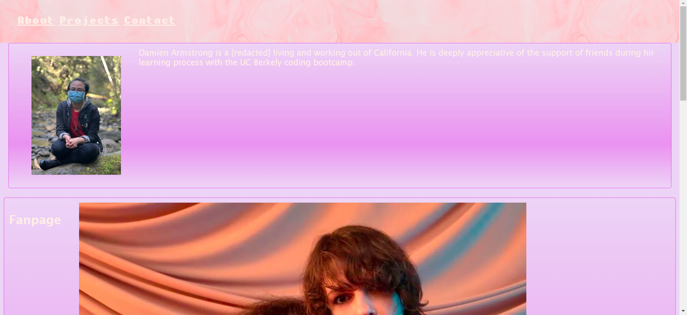
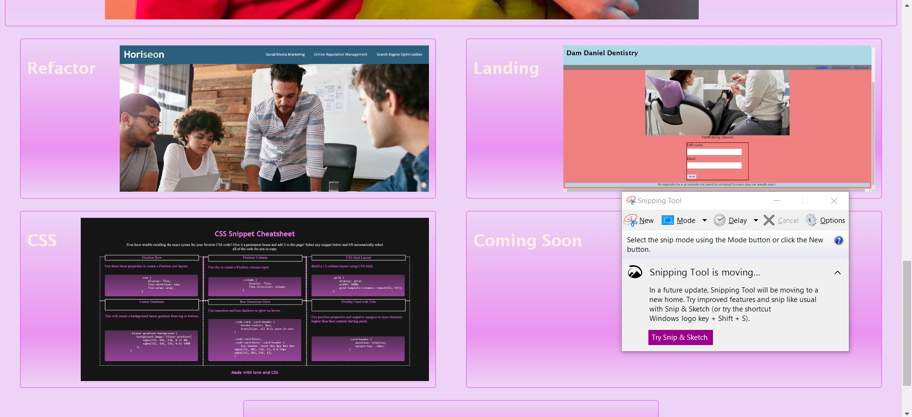
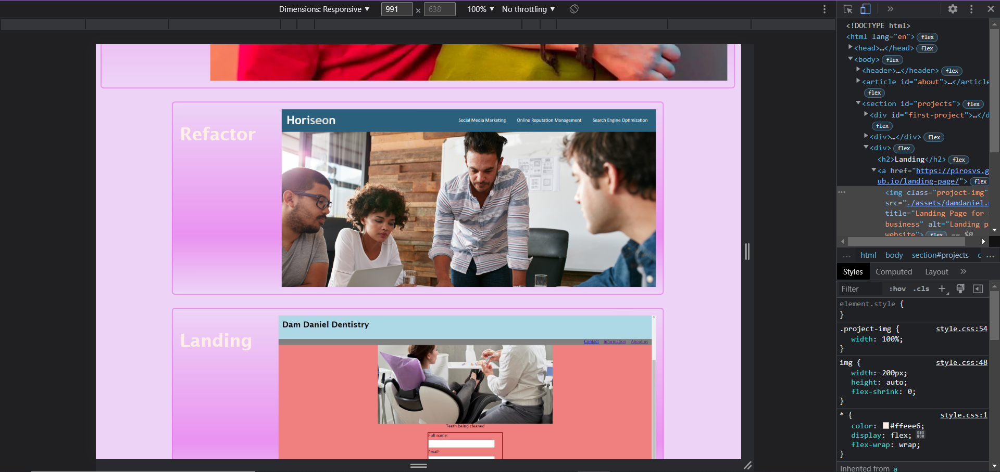

# portfolio

<a href="https://pirosvs.github.io/portfolio/">Click here to view the site</a>

## Description

 

This site is a portfolio to show off work and competency as a programmer as well as basic competency in design. Navigation links to each section of the page for ease of access and sections are clearly marked through use of bordered boxes to distinguish each section from the other. Images are used to represent past work to allow those browsing the site to quickly understand relevant competency and compare to desired skills.

This project uses html, semantic html for screen readers, css for design. Flexbox and media queries were also used to create a responsive design for a site that can be viewed on a number of different devices and screens. It also uses github and gitbash to display the process of creating the site and allow myself to understand what changes create new problems in the document.

## Credits
Credit to pre-existing code from those involved with teaching the UCB Coding Bootcamp for the design for the refactor project and the CSS Cheat Sheet, as well as to my girlfriend for fixing some errors with the orientation of things on the page.

## License
This project falls under the MIT license.

## Author
Damien Armstrong can be found on: <a href="https://www.linkedin.com/in/damien-armstrong-412319138/">Linkedin</a>, <a href="https://github.com/pirosvs">Github</a>